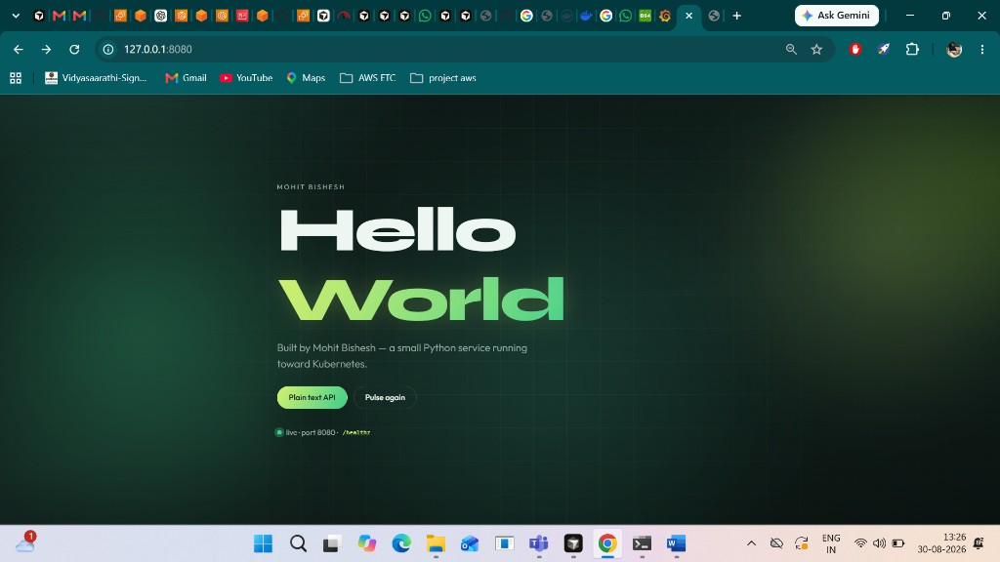
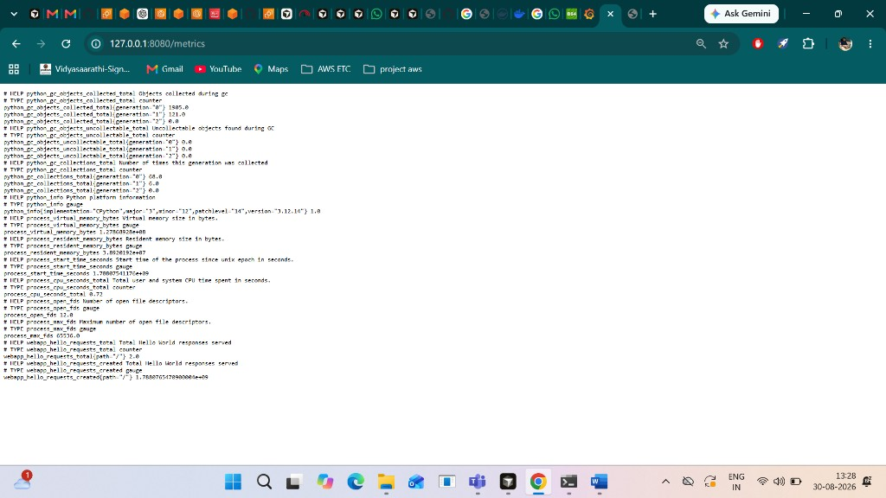
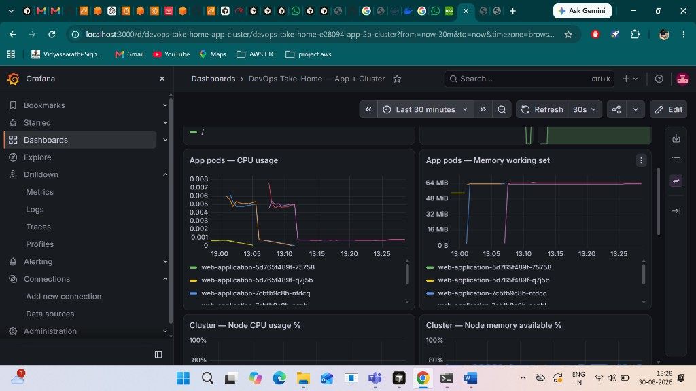
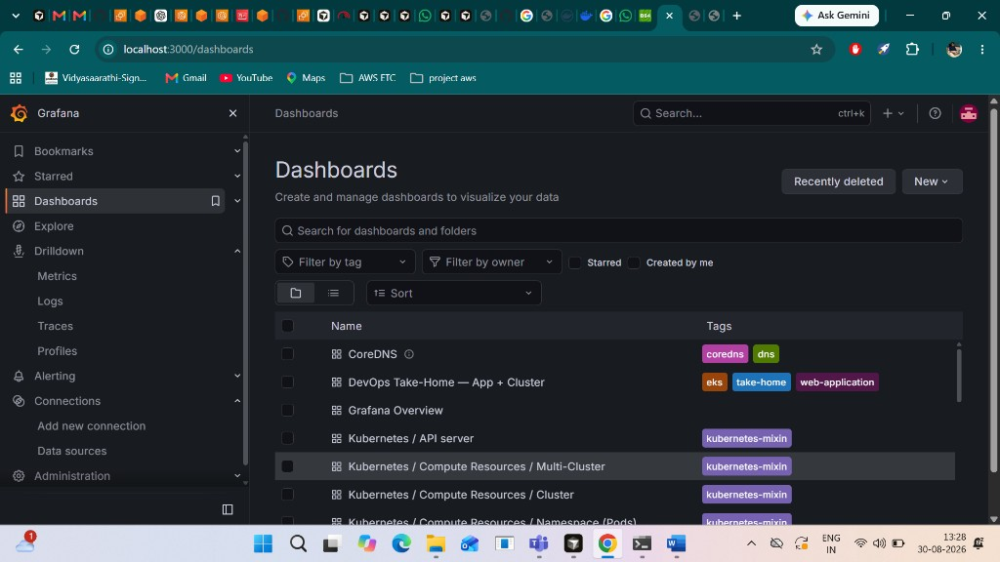
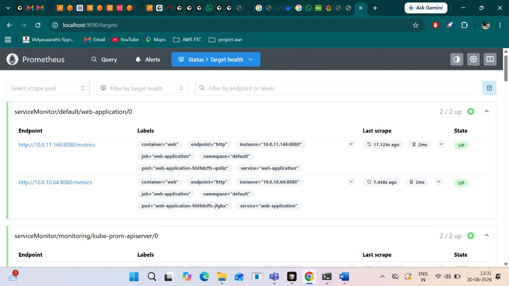

# terraform-eks

DevOps take-home: provision **Amazon EKS** with Terraform, deploy a **Hello World** Python microservice with **Helm**, and monitor the cluster and app with **Prometheus + Grafana**.

| Phase | Status | Contents |
|-------|--------|----------|
| 1 - EKS + VPC | Done | Terraform at repo root + `modules/` |
| 2 - Hello World app | Done | `web-application/` (Python + Dockerfile + UI) |
| 3 - Helm chart (app) | Done | `helm-charts/web-application/` |
| 4 - Prometheus / Grafana | Done | `helm-charts/monitoring/` + public `kube-prometheus-stack` |
| 5 - CI/CD | Optional | GitHub Actions / similar |

---

## Repository layout (what lives where)

```
terraform-eks/
├── README.md
├── .gitignore
├── .terraform.lock.hcl
├── docs/
│   └── images/              # README screenshots (UI, metrics, Grafana, Prometheus)
│
├── # ---- Phase 1: Terraform (EKS + network) ----
├── versions.tf              # Terraform + provider version pins
├── providers.tf             # AWS provider + default tags
├── backend.tf               # State backend (local by default; S3 example commented)
├── variables.tf             # Inputs (region, cluster name, nodes, endpoint CIDRs, …)
├── terraform.tfvars.example # Sample values (copy to terraform.tfvars)
├── terraform.tfvars         # Local overrides (gitignored — do not commit secrets/IPs)
├── main.tf                  # Wires module.vpc + module.eks
├── outputs.tf               # Cluster name, endpoint, VPC IDs, kubectl helper, …
├── modules/
│   ├── vpc/                 # VPC, subnets, IGW, single NAT, route tables
│   │   ├── main.tf
│   │   ├── variables.tf
│   │   ├── outputs.tf
│   │   └── versions.tf
│   └── eks/                 # EKS cluster, node group, IAM, OIDC, add-ons
│       ├── main.tf          # Cluster + managed node group + IAM roles
│       ├── addons.tf        # vpc-cni, coredns, kube-proxy, ebs-csi + IRSA
│       ├── variables.tf
│       ├── outputs.tf
│       └── versions.tf
│
├── # ---- Phase 2: Application source + container image ----
├── web-application/
│   ├── app.py               # Flask app: UI, /api/hello, /healthz, /metrics
│   ├── requirements.txt     # flask, gunicorn, prometheus-client
│   ├── Dockerfile           # python:3.12-slim, non-root, port 8080
│   ├── .dockerignore
│   ├── templates/
│   │   └── index.html       # Animated Hello World UI (Mohit Bishesh)
│   └── static/
│       ├── css/styles.css
│       └── js/main.js
│
├── # ---- Phase 3: App Helm chart ----
├── helm-charts/
│   └── web-application/
│       ├── Chart.yaml
│       ├── values.yaml      # Image, replicas, resources, nodeSelector, probes, ServiceMonitor
│       └── templates/
│           ├── _helpers.tpl
│           ├── deployment.yaml
│           ├── service.yaml
│           ├── servicemonitor.yaml   # Tells Prometheus to scrape /metrics
│           └── NOTES.txt
│
└── # ---- Phase 4: Monitoring overrides + Grafana dashboard ----
    └── monitoring/
        ├── kube-prometheus-stack-values.yaml
        │         # Custom values for public chart prometheus-community/kube-prometheus-stack
        │         # (Alertmanager off, no PVCs, Grafana 1Gi limit, scrape discovery, …)
        └── grafana-dashboard-devops-take-home.yaml
                  # ConfigMap (label grafana_dashboard=1) auto-loaded by Grafana sidecar
```

### Quick map

| Path | What it is | Used by |
|------|------------|---------|
| `*.tf`, `modules/` | AWS EKS + VPC IaC | `terraform plan/apply` |
| `web-application/app.py` | Application code | Docker build / local Python |
| `web-application/Dockerfile` | Container image definition | `docker build` → Docker Hub |
| `web-application/templates` + `static` | UI assets | Served by Flask |
| `helm-charts/web-application/` | App Kubernetes manifests as Helm chart | `helm upgrade --install web-application …` |
| `helm-charts/web-application/templates/servicemonitor.yaml` | Prometheus scrape definition for the app | Prometheus Operator |
| `helm-charts/monitoring/kube-prometheus-stack-values.yaml` | Override file for upstream monitoring chart | `helm … -f` with kube-prometheus-stack |
| `helm-charts/monitoring/grafana-dashboard-devops-take-home.yaml` | Grafana dashboard **ConfigMap** | `kubectl apply -f` → Grafana sidecar |
| `docs/images/` | Screenshots for this README | GitHub / documentation |

Published container image used in cluster: **`mohitbishesh/hello-world:main`** (Docker Hub; keep the repo **Public**).

---

## Screenshots (working demo)

### 1. Application UI

Hello World landing page served from the cluster via `kubectl port-forward svc/web-application 8080:80` → http://127.0.0.1:8080/



### 2. Application metrics endpoint

Prometheus exposition format at http://127.0.0.1:8080/metrics (includes `webapp_hello_requests_total` and Python/process metrics).



### 3. Grafana dashboard — App + Cluster

Custom dashboard **DevOps Take-Home — App + Cluster** (pod CPU/memory, node CPU/memory, and more).



### 4. Grafana dashboards list

Built-in Kubernetes mixin dashboards plus the custom take-home dashboard.



### 5. Prometheus targets

`serviceMonitor/default/web-application/0` showing **2/2 up** — both app pods scraped at `:8080/metrics`.



---

## Phase 1 - Terraform: provision EKS infrastructure

Phase 1 uses **Terraform** to create a cost-conscious, production-like **Amazon EKS** cluster in **`us-east-1`**, including VPC networking, IAM, managed node group, and essential add-ons.

Terraform code lives at the **repo root** (`versions.tf`, `providers.tf`, `main.tf`, `variables.tf`, `outputs.tf`, `backend.tf`) and under `modules/vpc` + `modules/eks`.

### What Terraform creates

Worker nodes have **no public IPs**. Outbound internet goes through a **single NAT Gateway**. Node labels include `role=worker` and `workload.type=worker-webapp`.

| # | AWS resource type | Name / identity (pattern) | Count | Module | Notes |
|---|-------------------|---------------------------|------:|--------|-------|
| 1 | VPC | `{cluster_name}-vpc` | 1 | `vpc` | CIDR `10.0.0.0/16` |
| 2 | Internet Gateway | `{cluster_name}-igw` | 1 | `vpc` | |
| 3–4 | Public subnets | `{cluster_name}-public-{az}` | 2 | `vpc` | `us-east-1a/b` |
| 5–6 | Private subnets | `{cluster_name}-private-{az}` | 2 | `vpc` | Worker subnets |
| 7 | Elastic IP | `{cluster_name}-nat-eip` | 1 | `vpc` | For NAT |
| 8 | NAT Gateway | `{cluster_name}-nat` | 1 | `vpc` | Single NAT (cost trade-off) |
| 9–14 | Route tables / routes / associations | — | — | `vpc` | Public→IGW; private→NAT |
| 15–20 | IAM roles + policy attachments | cluster + node roles | — | `eks` | AWS managed policies |
| 21 | EKS cluster | `devops-kubernetes-learning` | 1 | `eks` | Kubernetes **1.35** (variable) |
| 22 | Managed node group | `{cluster_name}-workers` | 1 | `eks` | `t3.medium`, 2–3 nodes |
| 23–25 | OIDC + EBS CSI IRSA | — | — | `eks` | |
| 26–29 | EKS add-ons | vpc-cni, coredns, kube-proxy, ebs-csi | 4 | `eks` | |

**Also created by AWS (not separate Terraform resources):** cluster/node security groups, ENIs, EC2 instances for the node group.

### Architecture

```
VPC 10.0.0.0/16
├── Internet Gateway
├── Public subnet us-east-1a (10.0.0.0/24) -- NAT Gateway + EIP
├── Public subnet us-east-1b (10.0.1.0/24)
├── Private subnet us-east-1a (10.0.10.0/24) -- EKS worker nodes
└── Private subnet us-east-1b (10.0.11.0/24) -- EKS worker nodes
         └── both private route tables -> single NAT
```

### Prerequisites

- [Terraform](https://developer.hashicorp.com/terraform/install) `>= 1.5`
- [AWS CLI v2](https://docs.aws.amazon.com/cli/latest/userguide/getting-started-install.html)
- IAM permissions to create VPC, EKS, IAM, EC2 (instance profile or user — **do not hard-code keys in code**)
- `kubectl` (after the cluster exists)

```bash
aws sts get-caller-identity
```

### Steps to run Terraform and spin up the infrastructure

Run all commands from the **cloned repository root** (the directory that contains `main.tf`).

#### 1. Configure variables

```bash
cp terraform.tfvars.example terraform.tfvars
```

Edit `terraform.tfvars`. Important settings:

| Variable | Purpose |
|----------|---------|
| `cluster_name` | Default `devops-kubernetes-learning` |
| `kubernetes_version` | Default `1.35` |
| `endpoint_private_access` | `true` — API reachable inside VPC |
| `endpoint_public_access` | `true` — needed for laptop/`kubectl` over the internet |
| `public_access_cidrs` | Your **public** IP as `/32` (not `192.168.x.x`) |

Find your public IP:

```bash
# Linux / macOS / Git Bash
curl -s https://checkip.amazonaws.com

# Windows PowerShell
(Invoke-RestMethod -Uri "https://checkip.amazonaws.com").Trim()
```

Example:

```hcl
endpoint_private_access = true
endpoint_public_access  = true
public_access_cidrs     = ["YOUR.PUBLIC.IP/32"]
```

Never commit `0.0.0.0/0` as a default. Keep `terraform.tfvars` out of git (gitignored).

#### 2. Initialize Terraform

Downloads providers and sets up the backend (local state by default):

```bash
terraform init
```

#### 3. Format and validate

```bash
terraform fmt -recursive
terraform validate
```

#### 4. Plan

```bash
terraform plan
```

Review carefully: VPC, **1 NAT**, EKS control plane, **2× t3.medium** nodes, EIP. Expect **0 to destroy** on a fresh apply (many resources to **add**).

Tip: for long applies over SSH, use `tmux`/`screen` so a disconnect does not kill Terraform mid-create.

#### 5. Apply (creates AWS resources — will incur cost)

```bash
terraform apply
```

Type `yes` when prompted. First apply typically takes **15–25 minutes** (EKS control plane + node group).

Useful outputs after apply:

```bash
terraform output
```

#### 6. Configure kubectl

```bash
aws eks update-kubeconfig --region us-east-1 --name devops-kubernetes-learning
kubectl get nodes
kubectl get nodes --show-labels
kubectl get pods -A
```

If the console user/IAM user differs from the principal that ran Terraform, create an **EKS access entry** for that IAM principal (IAM admin alone is not enough for Kubernetes API access).

#### 7. Destroy when finished (stop billing)

```bash
terraform destroy
```

Confirm NAT EIP, node group, and cluster are gone in the AWS console.

### Cost and availability trade-offs

| Choice | Benefit | Trade-off |
|--------|---------|-----------|
| 2 AZs (not 3) | Lower footprint | Less AZ diversity |
| **1 NAT Gateway** | ~½ NAT cost vs per-AZ | NAT AZ failure breaks private egress |
| `t3.medium` × 2 (max 3) | Low compute cost | Limited capacity for heavy add-ons |
| Private worker nodes | Better isolation | Need NAT for image pulls |
| Control-plane logging off by default | Avoids CloudWatch spend | Enable via `enable_cluster_log_types` if needed |

**Main recurring cost drivers:** NAT Gateway, 2× `t3.medium`, EKS control plane (~$0.10/hr). Rough lean total if left running: on the order of **~$170–220/month**. Destroy when idle.

### Security notes (Phase 1)

- Nodes only in **private** subnets (`map_public_ip_on_launch = false`)
- EKS API: private on; public optional and **CIDR-restricted**
- Cluster/node IAM uses AWS managed policies; EBS CSI uses **IRSA**
- No access keys stored in Terraform files

---

## Phase 2 - Hello World application

Small **Flask** service with an animated landing page, plus plain-text, health, and metrics endpoints.

| Path | Response |
|------|----------|
| `GET /` | Styled HTML page with animated **Hello World** |
| `GET /api/hello` | Plain text `Hello World` (assignment-friendly) |
| `GET /healthz` | `ok` (200) for probes |
| `GET /metrics` | Prometheus metrics (`webapp_hello_requests_total`, etc.) |

Container listens on **port 8080** and runs as a non-root user with **gunicorn**.

### Run locally (without Docker)

```powershell
cd web-application
python -m venv .venv
.\.venv\Scripts\Activate.ps1
pip install -r requirements.txt
python app.py
# UI:   http://127.0.0.1:8080/
# text: http://127.0.0.1:8080/api/hello
```

### Build and run with Docker

```powershell
cd web-application
docker build -t web-application:local .
docker run --rm -p 8080:8080 web-application:local
```

```powershell
curl http://127.0.0.1:8080/api/hello
curl http://127.0.0.1:8080/healthz
```

Open `http://127.0.0.1:8080/` in a browser for the UI.

### Push image to Docker Hub

Bare tags like `hello-world:main` push to Docker's **official** repo and will fail. Always prefix with your Hub username:

```bash
cd web-application
docker login -u mohitbishesh
docker build -t mohitbishesh/hello-world:main .
docker push mohitbishesh/hello-world:main
```

If you already built `hello-world:local`:

```bash
docker tag hello-world:local mohitbishesh/hello-world:main
docker push mohitbishesh/hello-world:main
```

If push says `insufficient scopes`, create a Docker Hub **Personal Access Token** with Read/Write and login again with that token as the password.

### Next (still to do)

- Optional: CI/CD (GitHub Actions)
- Optional: HPA / NetworkPolicy

---

---

## Helm operations (Phase 3 + 4)

This section lists the **Helm commands used in this project**, in the order you should run them, with short explanations.

### Prerequisites

```bash
# Point kubectl at the EKS cluster (once per shell / machine)
aws eks update-kubeconfig --region us-east-1 --name devops-kubernetes-learning

# Confirm cluster access
kubectl get nodes
kubectl get pods -A

# Helm 3 must be installed
helm version
```

Work from the **repo root** (`terraform-eks/`) so relative `-f` / chart paths resolve correctly.

---

### Phase 3 — Deploy the Hello World app (local chart)

**Chart:** `./helm-charts/web-application`  
**Image:** `mohitbishesh/hello-world:main` (Docker Hub; repo must be **public**)

What the chart creates:
- `Deployment` (2 replicas, probes, resources, nodeSelector)
- `Service` (`ClusterIP` port 80 → container 8080)
- `ServiceMonitor` (scrapes `/metrics` after Prometheus Operator is installed)

#### Install or upgrade the app

```bash
# Install if missing, or upgrade if already installed
helm upgrade --install web-application ./helm-charts/web-application \
  --namespace default \
  --create-namespace \
  --set image.repository=mohitbishesh/hello-world \
  --set image.tag=main \
  --set image.pullPolicy=Always
```

| Flag | Why |
|------|-----|
| `upgrade --install` | Idempotent: create or update in one command |
| `./helm-charts/web-application` | Our custom chart (not a remote repo chart) |
| `--set image.*` | Points at your Docker Hub image/tag |
| `pullPolicy=Always` | Picks up newly pushed `:main` images |

#### Verify the app release

```bash
helm list -n default
helm status web-application -n default

kubectl get deploy,svc,pods -l app.kubernetes.io/name=web-application
kubectl get servicemonitor -A   # appears after kube-prometheus-stack CRDs exist
```

#### Access the app UI

```bash
kubectl port-forward svc/web-application 8080:80
```

- UI: http://127.0.0.1:8080/  
- Plain text: http://127.0.0.1:8080/api/hello  
- Health: http://127.0.0.1:8080/healthz  
- Metrics: http://127.0.0.1:8080/metrics  

#### Update app after a new image push

```bash
docker build -t mohitbishesh/hello-world:main ./web-application
docker push mohitbishesh/hello-world:main

helm upgrade --install web-application ./helm-charts/web-application \
  --namespace default \
  --set image.repository=mohitbishesh/hello-world \
  --set image.tag=main \
  --set image.pullPolicy=Always

kubectl rollout restart deployment/web-application
kubectl rollout status deployment/web-application
```

#### Uninstall the app

```bash
helm uninstall web-application -n default
```

---

### Phase 4 — Install Prometheus + Grafana (public chart + values override)

We use the public chart **`prometheus-community/kube-prometheus-stack`** (Prometheus Operator, Prometheus, Grafana, node-exporter, kube-state-metrics) with our override file:

`helm-charts/monitoring/kube-prometheus-stack-values.yaml`

That file is intentional for this take-home:
- **Alertmanager disabled** (not required; saves RAM/CPU)
- **No PVCs** (no extra EBS cost; metrics/dashboard data are ephemeral)
- Short Prometheus retention (`3d`)
- Grafana memory sized to avoid **OOMKilled** when opening the UI (`512Mi` request / `1Gi` limit)
- ServiceMonitor discovery enabled across namespaces (so the app can be scraped)
- EKS control-plane scrapes disabled (etcd / scheduler / controller-manager)

#### 1) Add the Helm repo

```bash
helm repo add prometheus-community https://prometheus-community.github.io/helm-charts
helm repo update
helm search repo kube-prometheus-stack
```

#### 2) Create the monitoring namespace

```bash
kubectl create namespace monitoring
# safe to re-run:
# kubectl create namespace monitoring --dry-run=client -o yaml | kubectl apply -f -
```

#### 3) Install / upgrade the stack with our values file

```bash
helm upgrade --install kube-prom prometheus-community/kube-prometheus-stack \
  --namespace monitoring \
  --create-namespace \
  -f helm-charts/monitoring/kube-prometheus-stack-values.yaml
```

| Piece | Meaning |
|-------|---------|
| Release name `kube-prom` | Matches `fullnameOverride` in the values file (service names like `kube-prom-grafana`) |
| Chart `prometheus-community/kube-prometheus-stack` | Upstream public chart |
| `-f ...values.yaml` | **Custom overrides** (resources, Alertmanager off, retention, etc.) |

First install can take several minutes (image pulls + CRDs).

#### 4) Wait until monitoring pods are healthy

```bash
kubectl get pods -n monitoring -w
helm list -n monitoring
helm status kube-prom -n monitoring
```

Expect roughly:
- `prometheus-kube-prom-prometheus-0`
- `kube-prom-grafana-...`
- `kube-prom-operator-...`
- `kube-prom-kube-state-metrics-...`
- `kube-prom-prometheus-node-exporter-...` (one per node)

**Grafana memory check** (must not still be 256Mi after our fix):

```bash
kubectl get pod -n monitoring -l app.kubernetes.io/name=grafana \
  -o jsonpath="{.items[0].spec.containers[?(@.name=='grafana')].resources}" ; echo
```

#### 5) Integrate the web app with Prometheus

Integration path:

```
web-application pods expose GET /metrics
        ↓
ServiceMonitor (in app Helm chart)
        ↓
Prometheus Operator discovers ServiceMonitor
        ↓
Prometheus scrapes the Service
        ↓
Grafana uses Prometheus datasource (auto-provisioned by the stack)
```

Ensure the app image includes `/metrics`, then upgrade the app chart so the ServiceMonitor exists:

```bash
# Rebuild/push if /metrics was added after the last image push
docker build -t mohitbishesh/hello-world:main ./web-application
docker push mohitbishesh/hello-world:main

helm upgrade --install web-application ./helm-charts/web-application \
  --namespace default \
  --set image.repository=mohitbishesh/hello-world \
  --set image.tag=main \
  --set image.pullPolicy=Always

kubectl get servicemonitor -n default
kubectl describe servicemonitor -n default
```

#### 6) Access Prometheus UI and verify scrape targets

```bash
kubectl port-forward -n monitoring svc/kube-prom-kube-prome-prometheus 9090:9090
```

Open http://127.0.0.1:9090 → **Status → Targets**.

Look for a target related to `web-application` / ServiceMonitor — state should be **UP**.

Useful queries:
```promql
up
webapp_hello_requests_total
kube_pod_info{namespace="default"}
```

Generate app traffic, then re-query:

```bash
kubectl port-forward svc/web-application 8080:80
# visit http://127.0.0.1:8080/ a few times
```

#### 7) Access Grafana and explore dashboards

```bash
kubectl port-forward -n monitoring svc/kube-prom-grafana 3000:80
```

- URL: http://127.0.0.1:3000  
- User: `admin`  
- Password: `ChangeMe-DevOpsTakeHome` (from values file)

In Grafana:
1. Confirm **Prometheus** datasource is present (sidecar provisions it).
2. Open built-in dashboards (Kubernetes / Node / Compute Resources).
3. Import the custom take-home dashboard (next step).

If Grafana restarts when opening the UI, check for **OOMKilled** and re-apply the values file (Grafana limit must be **1Gi**):

```bash
helm upgrade kube-prom prometheus-community/kube-prometheus-stack \
  --namespace monitoring \
  -f helm-charts/monitoring/kube-prometheus-stack-values.yaml

kubectl rollout status deployment/kube-prom-grafana -n monitoring
```

#### 8) Load the custom Grafana dashboard (ConfigMap)

File: `helm-charts/monitoring/grafana-dashboard-devops-take-home.yaml`

This is a Kubernetes **ConfigMap** in namespace `monitoring` with label `grafana_dashboard: "1"`. The Grafana sidecar watches that label and loads the JSON dashboard automatically.

```bash
kubectl apply -f helm-charts/monitoring/grafana-dashboard-devops-take-home.yaml
```

Wait ~30 seconds, refresh Grafana → Dashboards → **DevOps Take-Home — App + Cluster**.

Generate app traffic so app panels have data:

```bash
kubectl port-forward svc/web-application 8080:80
# open http://127.0.0.1:8080/ several times
```

#### 9) What Prometheus scrapes (and useful queries)

**How discovery works:** Prometheus Operator reads **ServiceMonitor** / **PodMonitor** objects. Your app chart creates a ServiceMonitor that selects the app Service and scrapes path **`/metrics`**. Cluster components (node-exporter, kube-state-metrics, kubelet) get ServiceMonitors from `kube-prometheus-stack`.

| Source | Examples | Path / notes |
|--------|----------|--------------|
| **web-application** | `webapp_hello_requests_total` | ServiceMonitor → `/metrics` |
| **node-exporter** | `node_cpu_seconds_total`, `node_memory_*`, `node_filesystem_*` | Host metrics (DaemonSet) |
| **kube-state-metrics** | `kube_pod_*`, `kube_deployment_*`, `kube_node_*` | Kubernetes object state |
| **kubelet / cAdvisor** | `container_cpu_usage_seconds_total`, `container_memory_working_set_bytes` | Pod/container resources |
| **Not scraped** | etcd, scheduler, controller-manager | Disabled (AWS-managed on EKS) |
| **Not installed** | Alertmanager | Disabled in values (saves resources) |

**Application PromQL**

```promql
sum by (path) (rate(webapp_hello_requests_total[1m]))
sum(webapp_hello_requests_total)
up{job=~".*web-application.*"}
sum by (pod) (rate(container_cpu_usage_seconds_total{namespace="default", pod=~"web-application.*", container!="", container!="POD"}[5m]))
sum by (pod) (container_memory_working_set_bytes{namespace="default", pod=~"web-application.*", container!="", container!="POD"})
kube_deployment_spec_replicas{namespace="default", deployment=~"web-application.*"}
kube_deployment_status_replicas_available{namespace="default", deployment=~"web-application.*"}
```

**Cluster PromQL**

```promql
100 - (avg by (instance) (rate(node_cpu_seconds_total{mode="idle"}[5m])) * 100)
(node_memory_MemAvailable_bytes / node_memory_MemTotal_bytes) * 100
sum by (namespace) (kube_pod_status_phase{phase="Running"})
sum by (namespace, pod) (increase(kube_pod_container_status_restarts_total[5m])) > 0
(node_filesystem_avail_bytes{mountpoint="/"} / node_filesystem_size_bytes{mountpoint="/"}) * 100
```

List live scrape targets: Prometheus UI → **Status → Targets**.

```bash
kubectl get servicemonitor -A
kubectl get servicemonitor -n default -o yaml
```

If `kubectl get servicemonitor -n default` is empty, upgrade the app chart so the ServiceMonitor template is applied (CRDs must already exist from kube-prometheus-stack).

#### 10) Uninstall monitoring (when tearing down)

```bash
helm uninstall kube-prom -n monitoring
kubectl delete configmap grafana-dashboard-devops-take-home -n monitoring --ignore-not-found
kubectl delete namespace monitoring
```

---

### Quick command cheat sheet

```bash
# Repos
helm repo add prometheus-community https://prometheus-community.github.io/helm-charts
helm repo update

# App
helm upgrade --install web-application ./helm-charts/web-application -n default \
  --set image.repository=mohitbishesh/hello-world --set image.tag=main --set image.pullPolicy=Always

# Monitoring
helm upgrade --install kube-prom prometheus-community/kube-prometheus-stack -n monitoring --create-namespace \
  -f helm-charts/monitoring/kube-prometheus-stack-values.yaml

# Port-forwards
kubectl port-forward svc/web-application 8080:80
kubectl port-forward -n monitoring svc/kube-prom-grafana 3000:80
kubectl port-forward -n monitoring svc/kube-prom-kube-prome-prometheus 9090:9090

# Grafana custom dashboard ConfigMap
kubectl apply -f helm-charts/monitoring/grafana-dashboard-devops-take-home.yaml

# Cleanup
helm uninstall web-application -n default
helm uninstall kube-prom -n monitoring
```

---

## What's not included yet

- HPA, PDB, NetworkPolicy
- GitHub Actions CI/CD
- Persistent Grafana/Prometheus storage (intentionally off for cost)

Optional next steps after monitoring is verified.
